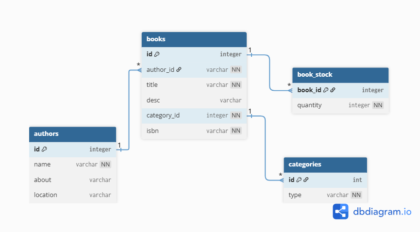

# BookStore
BookStore is an application that provides an interface to manage your book store.

### Functionality
- Books
    - Add Book
    - Delete Book
    - Update Book
    - Fetch All Books
    - Fetch Book by Id
- Authors
    - Add Author
    - Delete Author
- Categories
    - Add Category
    - Delete Category
- Stocks
    - Add Quantity
    - Remove Quantity
    
### Database Schema
---


## REST API Endpoints


### Get All Books  
**GET** `/books`

Returns a list of all books.

**Responses:**
- `200 OK` – Returns list of books
- `500 Internal Server Error`

---

### Get Book By ID  
**GET** `/books/{id}`

Returns a single book by its ID.

**Responses:**
- `200 OK` – Returns book details
- `400 Bad Request` – Invalid ID
- `404 Not Found` – Book does not exist

---

### Create Book  
**POST** `/books`

Creates a new book.

**Request Body (JSON):**

```json
{
  "title": "Clean Code",
  "author": "author_table_id",
  "price": 499.99,
  "stock": "book_stock_table_id",
  "isbn": "9780132350884"
}
```

### DELETE Book  
**POST** `/books/{id}`

Deletes the book by id.

**Request Body (JSON):**

```json
{
    "book_id": "12435"
}
```

### UPDATE Book  
**POST** `/books/{id}`

Deletes the book by id.

**Request Body (JSON):**


```json
{
  "title": "Clean Code By Arthur",
  "author": "author_table_id",
  "price": 222.99,
  "stock": "book_stock_table_id",
  "isbn": "9780132350884"
}
```

